**English** | [中文](docs/README.zh.md) | [हिन्दी](docs/README.hi.md) | [Español](docs/README.es.md) | [العربية](docs/README.ar.md) | [Français](docs/README.fr.md) | [বাংলা](docs/README.bn.md) | [Português](docs/README.pt.md) | [Русский](docs/README.ru.md) | [Bahasa Indonesia](docs/README.id.md) | [اردو](docs/README.ur.md) | [日本語](docs/README.ja.md) | [한국어](docs/README.ko.md)

# traffic66 — NetFlow, sFlow and IPFIX collector and traffic analyzer

Flow analytics for sFlow, NetFlow and IPFIX in a single program: who uses
the bandwidth, where the traffic goes, and whether the numbers match the
devices' own interface counters, in a web UI and a terminal UI.

A self-hosted alternative to ntopng, ElastiFlow, pmacct with Grafana, or
the flow modules of PRTG and SolarWinds NTA, for network monitoring,
bandwidth monitoring, top talkers, DDoS and scan detection and pcap
analysis, without Elasticsearch, Kafka or a separate database.

- One executable for Windows, Linux and macOS; no database to install, works offline.
- sFlow v5, NetFlow v5/v9 and IPFIX on any UDP port, or local capture from an interface.
- Checks its numbers against interface counters (sFlow or SNMP) and says why they differ.
- Finds scans, password guessing, lateral movement, unusual uploads, floods and threat list traffic, also through sampling.
- `traffic66 capture.pcap` analyses packet captures with nothing to set up.
- 13 languages. Free for evaluation and for organizations under 100 people ([licence](#licence)).

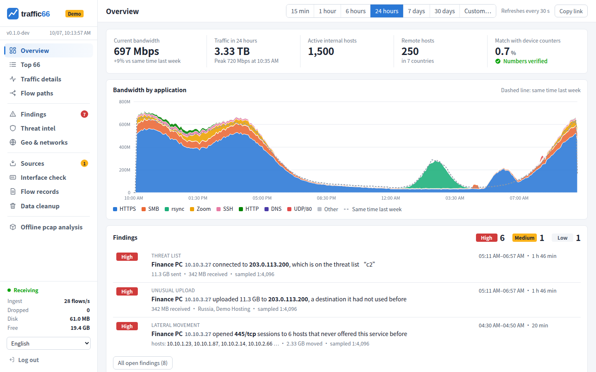

<sub>All screenshots come from `traffic66 demo`, a simulated company network.</sub>

## Contents

1. [Try the demo](#1-try-the-demo)
2. [Install](#2-install)
3. [Users and passwords](#3-users-and-passwords)
4. [Send flows from your devices](#4-send-flows-from-your-devices)
5. [Check that flows arrive](#5-check-that-flows-arrive)
6. [Interfaces and counters](#6-interfaces-and-counters)
7. [Names, countries and threat lists](#7-names-countries-and-threat-lists)
8. [Using the web UI](#8-using-the-web-ui)
9. [Offline pcap, terminal UI, local capture](#9-offline-pcap-terminal-ui-local-capture)
10. [Options and data](#10-options-and-data)
11. [Security, sizing, troubleshooting](#11-security-sizing-troubleshooting)

## 1. Try the demo

Download your system's archive from the
[releases page](https://github.com/githubflyideas/traffic66/releases)
(Windows x64, Linux x86-64/ARM64 with kernel 3.2+, macOS 11+), unpack it and run:

```
./traffic66 demo -password try66          # Linux, macOS
.\traffic66.exe demo -password try66      # Windows
```

On macOS first run `xattr -dr com.apple.quarantine <folder>`. Open
http://127.0.0.1:8066 as `admin` / `try66`: a day of history and live
traffic from four simulated devices, including an attack shown step by step
on **Findings**. Ctrl+C stops it; delete `traffic66-demo` to start afresh.
To run it next to a real installation: `-addr :8067 -listen ""`.

## 2. Install

traffic66 is one file. Ports: UDP 6343 (sFlow), 2055 (NetFlow), 4739
(IPFIX), TCP 8066 (web UI); every UDP port accepts every protocol.

**Linux** (systemd):

```
sudo mkdir -p /opt/traffic66 && sudo tar xzf traffic66-linux-amd64.tar.gz -C /opt/traffic66 --strip-components=1
sudo useradd --system --no-create-home --shell /usr/sbin/nologin traffic66
sudo install -d -o traffic66 -g traffic66 /var/lib/traffic66
sudo -u traffic66 /opt/traffic66/traffic66 passwd -data /var/lib/traffic66
```

`/etc/systemd/system/traffic66.service`:

```
[Unit]
Description=traffic66 flow analytics
After=network-online.target

[Service]
User=traffic66
ExecStart=/opt/traffic66/traffic66 -data /var/lib/traffic66
Restart=on-failure
MemoryMax=2G
#AmbientCapabilities=CAP_NET_RAW CAP_NET_ADMIN   # only for local capture

[Install]
WantedBy=multi-user.target
```

```
echo 'net.core.rmem_max=16777216' | sudo tee /etc/sysctl.d/90-traffic66.conf && sudo sysctl --system
sudo systemctl daemon-reload && sudo systemctl enable --now traffic66
sudo firewall-cmd --permanent --add-port={6343,2055,4739}/udp --add-port=8066/tcp && sudo firewall-cmd --reload
```

**Windows** (PowerShell as Administrator): unpack to `C:\traffic66`, run
`C:\traffic66\traffic66.exe passwd`, open the ports, and start it at boot:

```
New-NetFirewallRule -DisplayName traffic66 -Direction Inbound -Protocol UDP -LocalPort 6343,2055,4739 -Action Allow
New-NetFirewallRule -DisplayName traffic66-web -Direction Inbound -Protocol TCP -LocalPort 8066 -Action Allow
$a = New-ScheduledTaskAction -Execute 'C:\traffic66\traffic66.exe' -Argument '-data C:\traffic66\traffic66-data'
$s = New-ScheduledTaskSettingsSet -ExecutionTimeLimit ([TimeSpan]::Zero) -RestartCount 999 -RestartInterval (New-TimeSpan -Minutes 1)
Register-ScheduledTask -TaskName traffic66 -Action $a -Trigger (New-ScheduledTaskTrigger -AtStartup) -Settings $s -User 'NT AUTHORITY\SYSTEM' -RunLevel Highest
Start-ScheduledTask -TaskName traffic66
```

Double-clicking `traffic66.exe` also works: it opens the web UI and shows
the first password in its window.

**macOS**: unpack to `/usr/local/traffic66`, remove the quarantine flag,
run `traffic66 passwd -data "/Library/Application Support/traffic66"`, and
start it from a LaunchDaemon whose `ProgramArguments` are the program,
`-data` and that directory, with `RunAtLoad` and `KeepAlive`.

## 3. Users and passwords

On first start traffic66 creates the user `admin` with a random password
and prints it once (in the window, the terminal, or
`journalctl -u traffic66 | grep "first start"`). Users are kept as salted
hashes in `password` in the data directory and managed with one command on
the traffic66 machine (add `-data …` when traffic66 runs with it):

| To | Command |
|---|---|
| Change the password of `admin` | `traffic66 passwd` |
| Add `alice` or change her password | `traffic66 passwd -user alice` |
| Delete `alice` | `traffic66 passwd -user alice -delete` |
| List users | `traffic66 passwd -list` |

Changes apply at once. All users have the same rights. For scripts and
containers, `TRAFFIC66_PASSWORD=…` (or `-password`) accepts only `-user`
with that password for that run. Five wrong passwords in a minute block the
address for a minute.

## 4. Send flows from your devices

`192.0.2.50` is traffic66, `192.0.2.1` the device. Set the active timeout to
60 seconds, let NetFlow/IPFIX devices export their sampler options, and
sample **every interface inbound** (or only the edge interfaces): each
packet then counts once. sFlow rates: about 1:1000 for 1 Gb/s, 1:4096 for
10 Gb/s, 1:8192 for 40/100 Gb/s.

```
! Cisco IOS-XE, NetFlow v9
flow exporter T66
 destination 192.0.2.50
 transport udp 2055
 option sampler-table
flow monitor T66
 exporter T66
 record netflow ipv4 original-input
 cache timeout active 60
interface GigabitEthernet0/0/0
 ip flow monitor T66 input
```

```
# Huawei CloudEngine, sFlow (H3C Comware is similar)
sflow agent ip 192.0.2.1
sflow collector 1 ip 192.0.2.50
interface 10GE1/0/1
 sflow sampling collector 1
 sflow sampling rate 4096
 sflow sampling inbound
 sflow counter collector 1
 sflow counter interval 30
```

```
# Juniper EX/QFX, sFlow
set protocols sflow collector 192.0.2.50 udp-port 6343
set protocols sflow sample-rate ingress 4096
set protocols sflow interfaces ge-0/0/0

# Arista EOS, sFlow
sflow sample 4096
sflow destination 192.0.2.50
sflow run

# MikroTik RouterOS 7
/ip traffic-flow set enabled=yes interfaces=all active-flow-timeout=1m
/ip traffic-flow target add dst-address=192.0.2.50 port=2055 version=9

# Linux host, softflowd
softflowd -i eth0 -n 192.0.2.50:2055 -v 9 -t maxlife=60
```

## 5. Check that flows arrive

**Settings** lists every device that sends anything within seconds: protocol,
sampling rate, loss, the interfaces it samples, and what to fix when the
status is not green. sFlow loss is split into loss on the way (raise
`net.core.rmem_max` if `netstat -su` shows buffer errors) and samples the
device itself dropped.

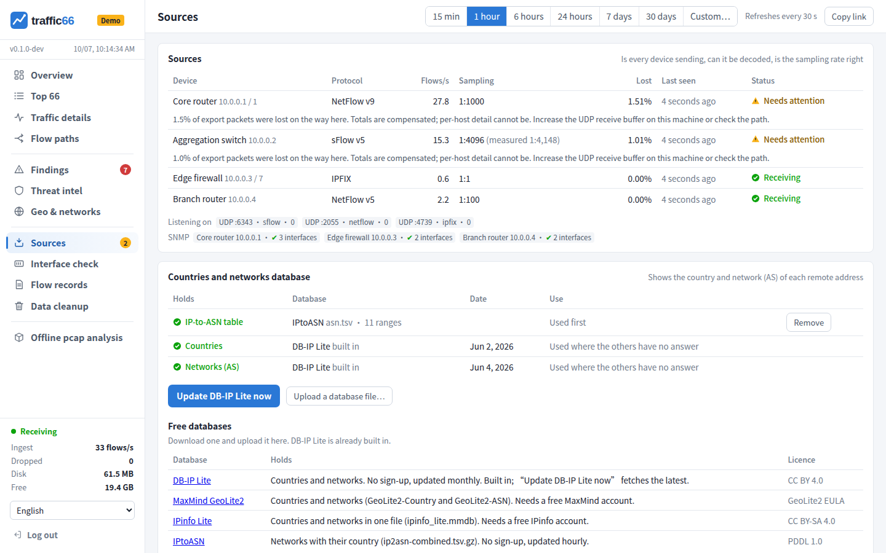

A device missing? Run `sudo tcpdump -ni any udp port 6343 or udp port 2055
or udp port 4739`: nothing there means routing, a firewall or the device
configuration; packets there but nothing in **Settings** means the local
firewall or `-listen`. `traffic66 simulate -to 192.0.2.50` from another
machine tests the path with simulated devices.

## 6. Interfaces and counters

Flow numbers are estimates (samples × sampling rate). **Interface check**
compares them with the device's interface counters (sFlow counters, or SNMP
via an `snmp` line in Names) and says why they differ: interfaces not
sampled, the same traffic sampled twice, loss on the way, or an unknown
sampling rate. Each interface has a bits/s and a packets/s chart, ingress
green and egress blue, counters dashed.

On each row, **✎** sets a name and a short tag (such as *uplink*) and
**☆** makes it the default interface (★), which the pages open on.

A device that samples only some interfaces also shows the other ends of
those flows. These **peer interfaces** are listed last in small grey type:
they only hold the traffic through the sampled interface. The sampled
interface is known from the sFlow data source or the flowDirection field
(IPFIX 61); without it, an interface on 90% of a device's traffic.

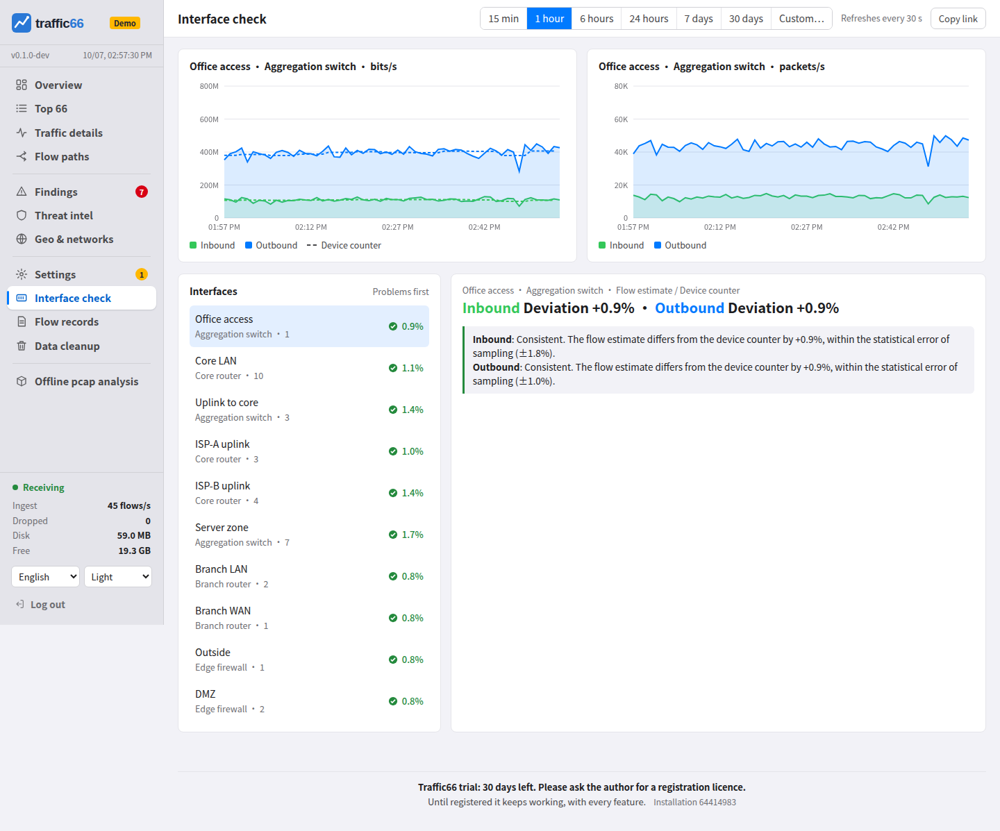

traffic66 already uses the rate the device applied, waits for unknown
rates, makes up for export loss, spreads long flows over their minutes and
adds 18 bytes per packet of Ethernet overhead to NetFlow/IPFIX
(`-l2-overhead`).

## 7. Names, countries and threat lists

Click any address and choose **Name it…**, or use **Settings → Names**.
Names are kept in `inventory.txt` in the data directory:

```
net    10.10.0.0/16    Office LAN                  # your networks
net    203.0.113.0/24  Public servers country=JP    # country: lines on the world map
device 192.0.2.1       Core router
device 192.0.2.9       Branch firewall unsampled    # exports every packet
device 192.0.2.20      Edge router sampling=1000    # rate it does not declare
iface  192.0.2.1 3     ISP uplink speed=1000000000 tag=uplink default
host   10.10.3.27      Finance PC
snmp   192.0.2.1       public                       # read counters over SNMPv2c
snmp   192.0.2.9       s3cret  10.99.0.9:161        # other management address
```

Private ranges are always yours. Changes apply on **Save**, no restart.

Countries and networks (AS) work out of the box with DB-IP's free Lite
databases ([CC BY 4.0](https://creativecommons.org/licenses/by/4.0/), "IP
Geolocation by DB-IP", [db-ip.com](https://db-ip.com)); **Settings** updates
them, or takes MaxMind GeoLite2, IPinfo Lite or IPtoASN files instead. Map
outlines: [Natural Earth](https://www.naturalearthdata.com).

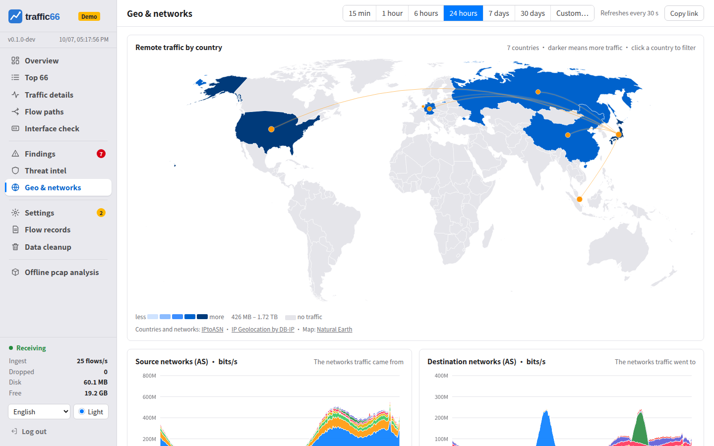

Threat lists are text files with one address or network per line in
`<data>/threats/<name>.txt` (for example Spamhaus DROP); restart after
changing them. Matches appear on **Threat intel**.

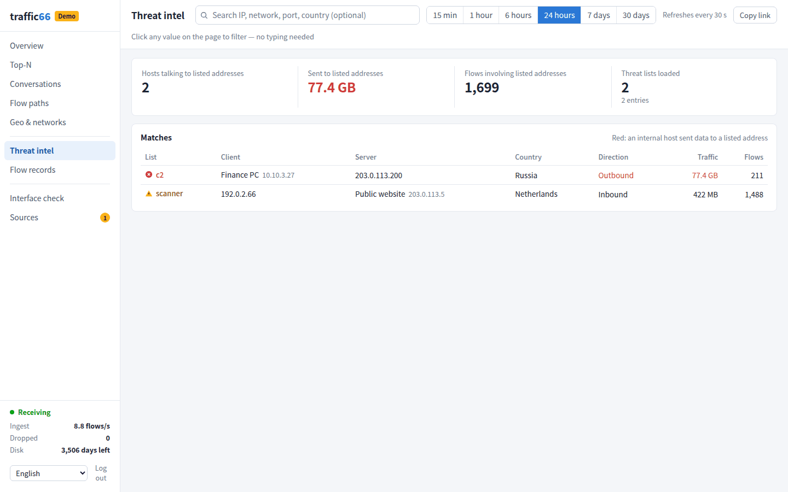

## 8. Using the web UI

Every value on every page can be clicked: **Show only this** / **Exclude
this** (filters apply to every page), **Show its flow records**, **Show
details** (a page about one host or service), **Name it…**, **Look it up
online**, **Copy**.

| Page | What it shows |
|---|---|
| Overview | The chosen interface's bandwidth; traffic by application (total, inbound or outbound) against yesterday or last week; open findings; top clients and services |
| Top 66 | The top 66 conversations, sortable by any column, or grouped by application, network, segment, device, encapsulation, VLAN; the top 30 talkers |
| Traffic details | Ring charts: servers and their clients (or the other way round), and services |
| Flow paths | Host → application → country, or client → service → server, or by network |
| Interface check | Every interface over time against its counters; names, tags, the default |
| Flow records | The individual flows, live every 5 seconds or for any time range |
| Findings, Threat intel | What needs attention ([below](#findings)); traffic with listed addresses |
| Geo & networks | A world map by country, networks (AS) over time |
| Settings | Devices, sampling, loss, SNMP, databases, logo, names |
| Offline pcap analysis, Data cleanup | Capture files ([below](#9-offline-pcap-terminal-ui-local-capture)); deleting old data |

Above the pages: **Interface** (all, or one sampled interface; the traffic
pages then show only traffic through it), the time range (15 minutes to 30
days, or custom), refresh every 30 s and **Copy link** for the exact view.
The language, and five colour themes, are at the foot of the menu. Charts
end where the data is complete: with NetFlow/IPFIX as late as the devices
export (at most 2 minutes). Ranges over 6 hours start on a whole hour; one
interface over 7 or 30 days reads the flow detail, so it is slower and
reaches back as far as detail is kept.

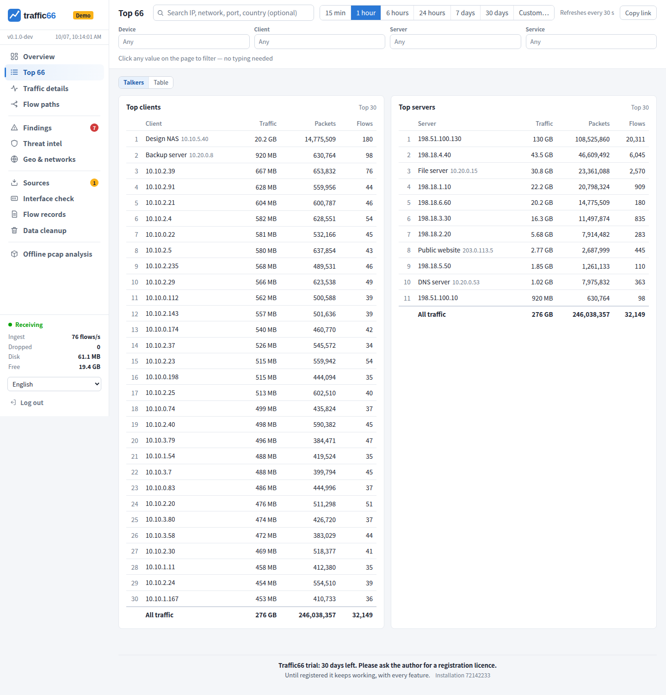

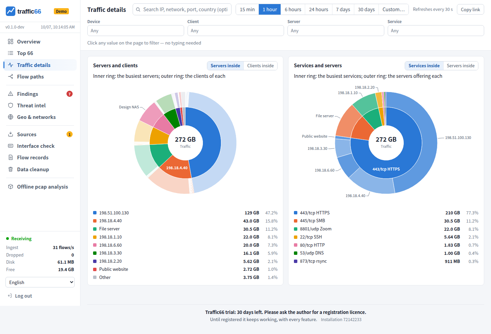

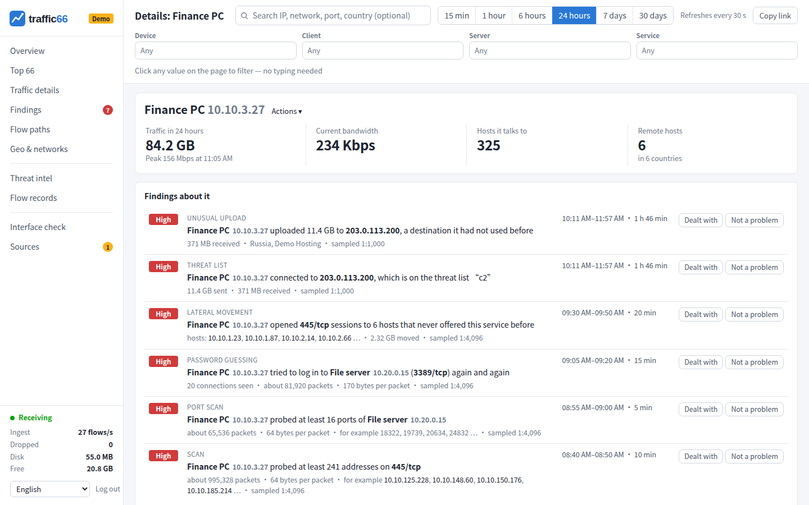

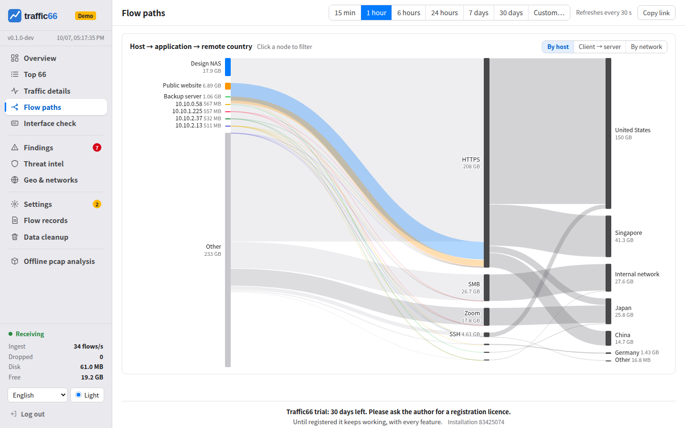

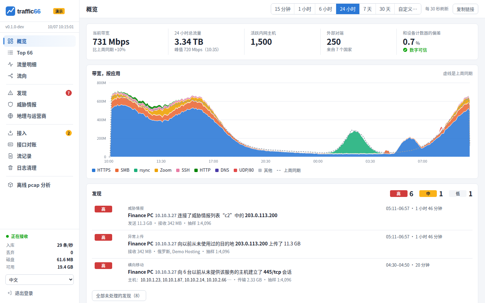

### Findings

Checked every 5 minutes over the last 10; something lasting an hour is one
growing finding.

| Finding | Meaning |
|---|---|
| Scan, port scan | Small probes to many hosts on one port, or many ports of one host |
| Password guessing | Many short connections to a login service |
| Lateral movement | File sharing or remote administration to internal hosts that never offered it before |
| Unusual upload | 100 MB in 10 minutes to a new address, three times what came back |
| Flood | 20,000+ small packets/s to one address, ten times its usual rate |
| Threat list | Traffic with a listed address |

From inside your network they are high, from the internet low. **Dealt
with** closes a finding, **Not a problem** silences it for good. Lateral
movement and uploads need a day of history. Through 1:4096 sampling the
demo's attack is found completely; very small scans can hide behind
sampling.

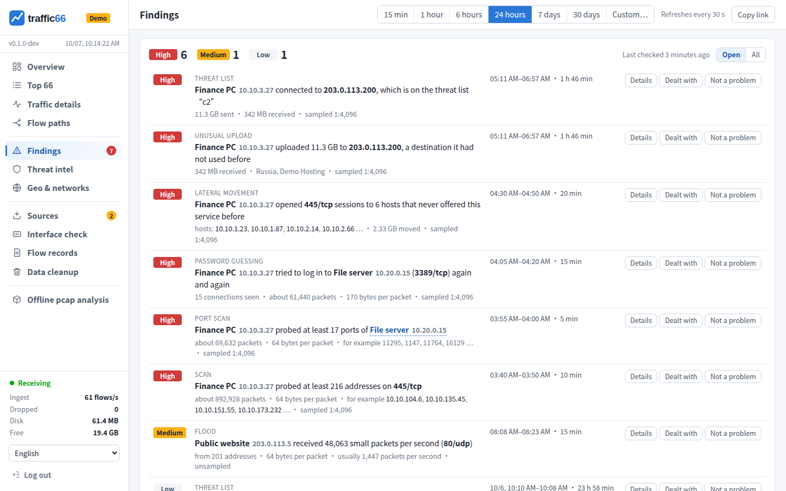

## 9. Offline pcap, terminal UI, local capture

**Offline pcap analysis** shows packet captures (pcap, pcapng) with the same
pages, apart from the live data: `traffic66 a.pcap b.pcapng` starts on
127.0.0.1 and opens the browser (up to 3 files, 3 GB; Ctrl+C deletes the
imported data), or upload up to 3 files of 50 MB on that page. One file is
analysed at a time, each in a database of its own: **Analyse** on a file's
row shows it on every page, and the bar at the top switches to another. It
works on flows, not packet contents.

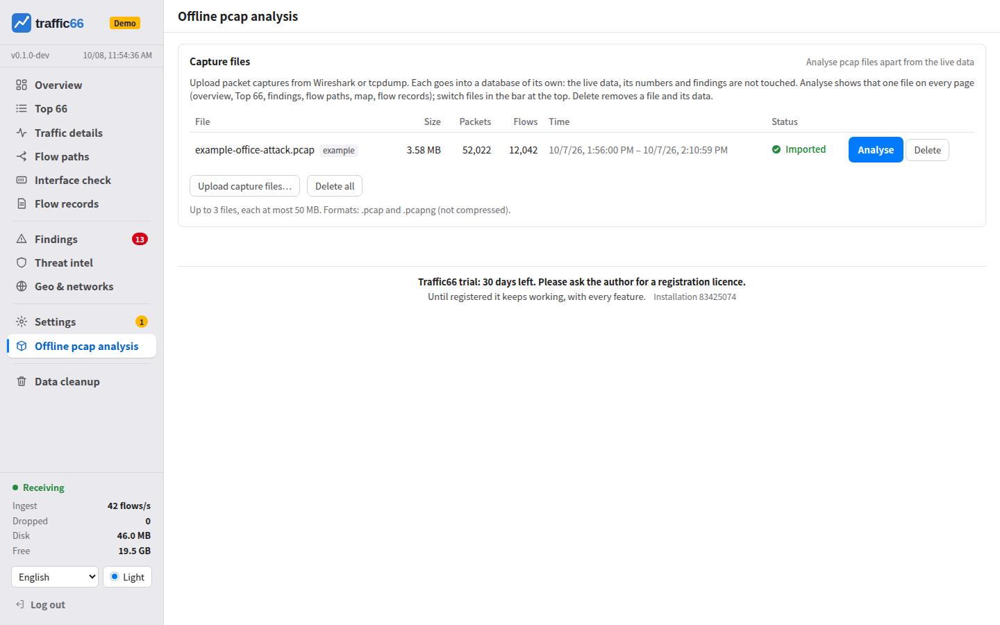

**Terminal UI**: `traffic66 tui` on the traffic66 machine, or
`traffic66 tui -server http://192.0.2.50:8066 -user admin -password …`.
Keys: 1–8 pages, Enter actions, f show only, x exclude, t time range, w open
in a browser, q quit; `-lang` picks the language.

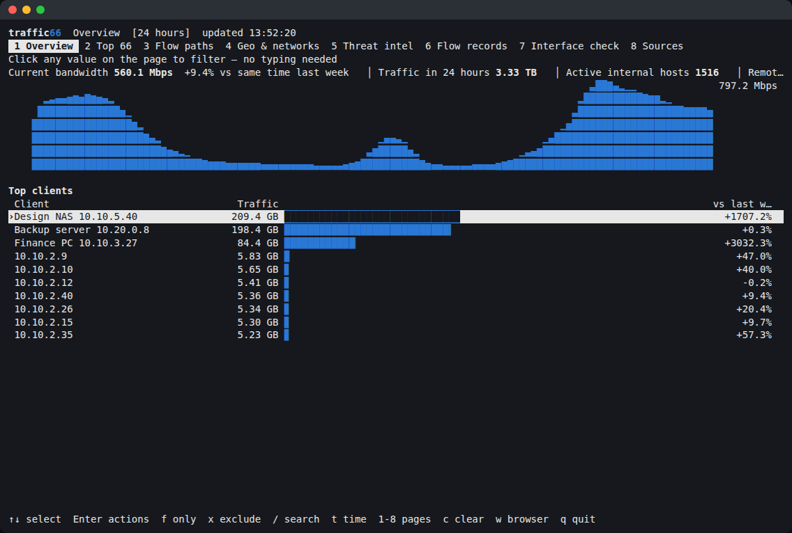

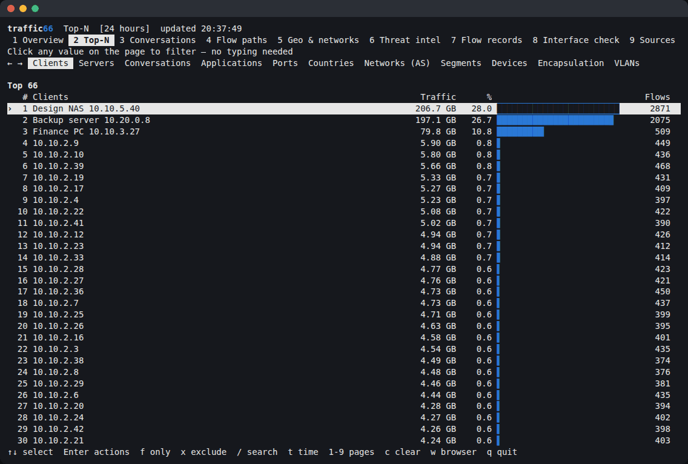

**Local capture** builds flows from a local interface, best a port
connected to a switch's mirror port: `traffic66 interfaces` lists them,
`-capture eth1` captures. On Windows:

```
traffic66.exe interfaces          # list the network cards: name, number, address
traffic66.exe -capture Wi-Fi      # capture on the wireless card (or by number: -capture 2)
```

Linux needs root or `setcap cap_net_raw,cap_net_admin+ep`, macOS root,
Windows [Npcap](https://npcap.com). Captured flows come from the device
`127.0.0.1`. Local capture has no device interfaces or counters, so
**Interface check** has nothing to compare for it.

## 10. Options and data

`traffic66 -h` lists everything. The most used:

| Option | Default | |
|---|---|---|
| `-data` | `traffic66-data` next to the program | data directory |
| `-addr` | `:8066` | web UI; `127.0.0.1:8066` for this machine only |
| `-listen` | `sflow=:6343,netflow=:2055,ipfix=:4739` | UDP collectors; empty disables |
| `-retention-days` | `30` | days of flow detail; summaries are kept 400 days |
| `-memory` | `0.10` | share of RAM for the database cache |
| `-sampling-wait` | `5m` | how long records wait for a sampling rate |
| `-capture` | | local interface (repeatable) |
| `-no-dns` | | no reverse lookups |

The data directory holds `raw/` (detail, one file per hour),
`traffic66.duckdb` (summaries and counters), `password`, `inventory.txt`,
`license.json`, your logo and databases. Back up by stopping traffic66 and
copying it; upgrade by replacing the program file. **Data cleanup** deletes
data older than 7–120 days, or all of it.

### Licence

Source available under the [PolyForm Noncommercial License 1.0.0](LICENSE.md)
and the [Traffic66 Additional Use Grant](ADDITIONAL-USE-GRANT.md) (English
binding): free for evaluation and for organizations under 100 people;
larger organizations register after 30 days of production use; selling,
hosting for others or competing products need a commercial licence. Nothing
is ever switched off. The foot of each page shows the 8-digit installation
number; send it to the author, and put the `license.json` you get back in
the data directory. Contact: <https://github.com/githubflyideas/traffic66>.

## 11. Security, sizing, troubleshooting

The web UI is plain HTTP: on untrusted networks use `-addr 127.0.0.1:8066`
behind a TLS proxy (`caddy reverse-proxy --from traffic66.example.com --to
127.0.0.1:8066`) or an SSH tunnel. Allow the UDP ports only from your
devices. SNMP communities are stored in clear text; use read-only ones.

At 5,000 flows/s on 2 cores: about 12 GB of disk per day of detail (360 GB
for 30 days), a sixth of a core, 0.6–0.8 GB of memory. Long-range overviews
take under 0.2 s; a 1-hour Top 66 of all conversations about 9 s.

| Symptom | Fix |
|---|---|
| "waiting for the sampling rate" | Export sampler options, or `sampling=N` / `unsampled` on the device line |
| Lower than the counters | Interfaces not sampled, loss, or an active timeout over 60 s |
| Higher than the counters | The same traffic sampled on two interfaces or devices |
| Forgot the password | `traffic66 passwd` on the traffic66 machine |
| `Conflicting lock is held` | Another traffic66 uses this data directory |
| `address already in use` | Choose other ports with `-addr` or `-listen` |
| Windows "protected your PC" | **More info** → **Run anyway** |

Build from source: Go 1.24 and a C compiler, then `scripts/build.sh 0.1.0 traffic66`.
